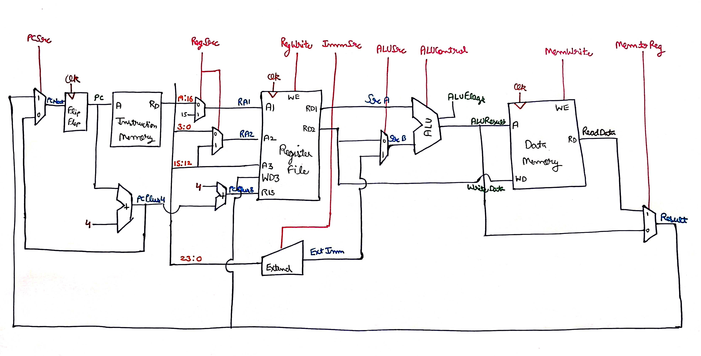
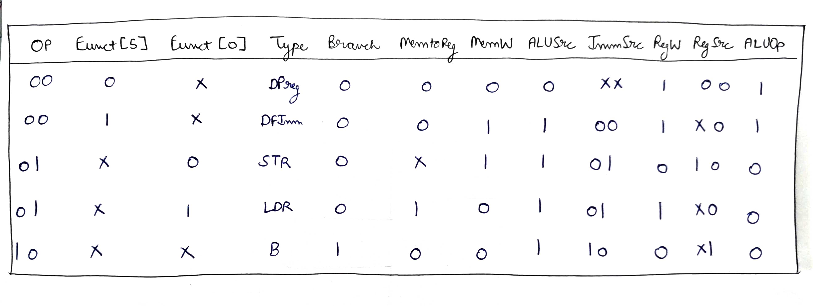
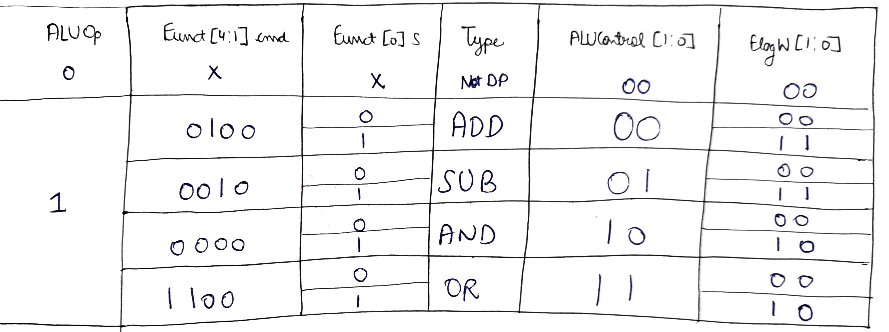
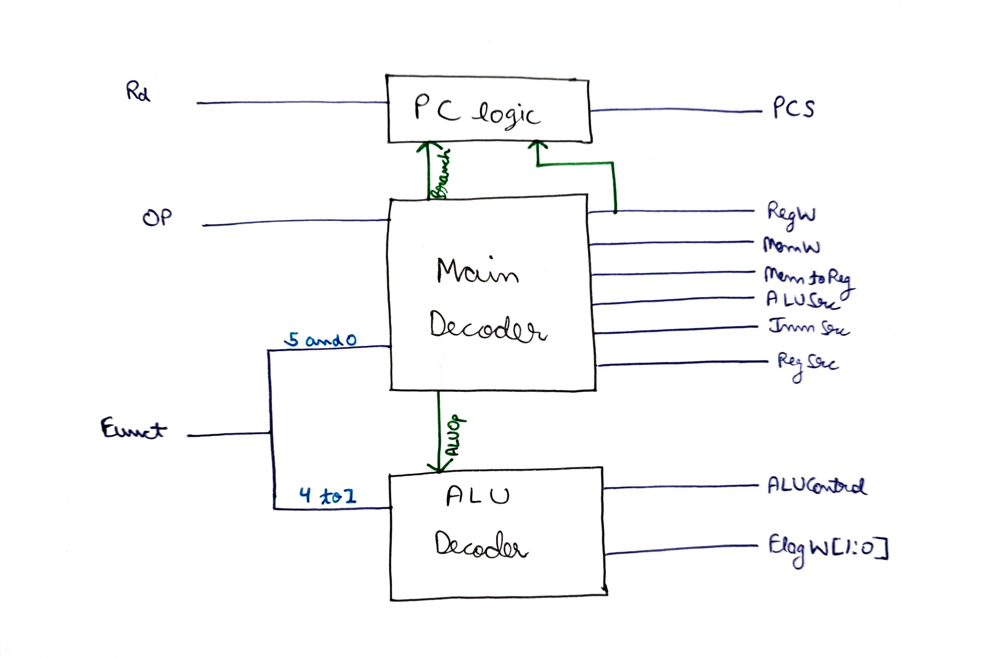
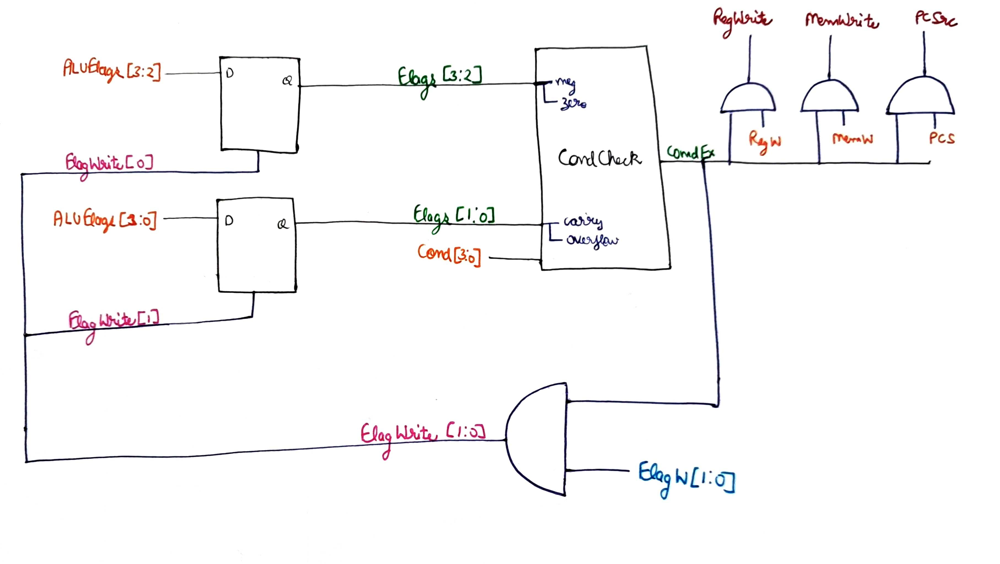
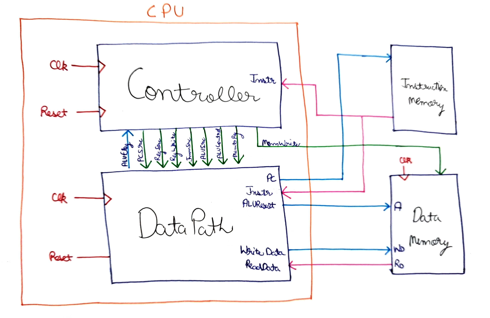

# 32-bit-ARM-CPU
## Instruction Set of ARM architecture 

## Data Path

## Control Unit

## Controller

## Decoder Logic

## ALU Decoder Working

## Decoder and Combinational logic 

## Bigger Picture

