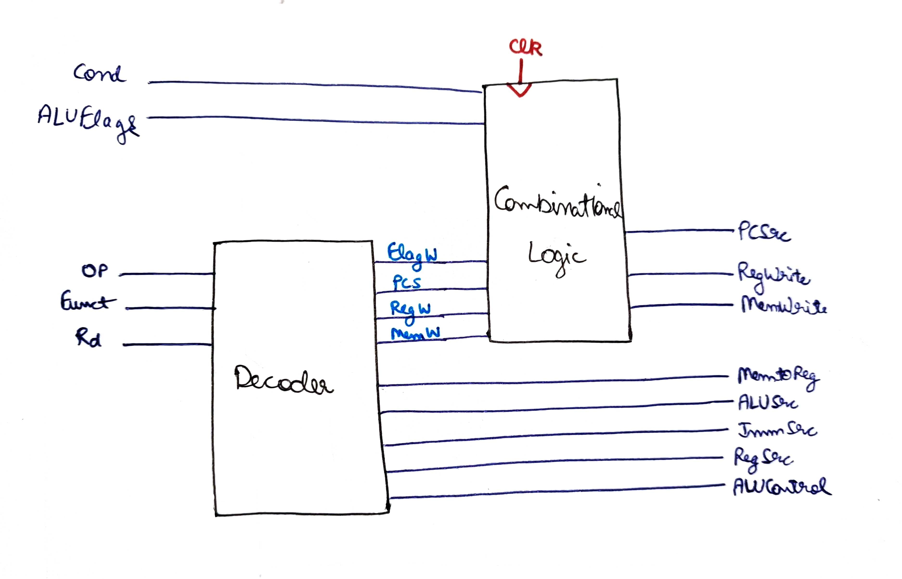

# 32-bit-ARM-CPU
## Instruction Set of ARM architecture 

## Data Path

## Control Unit

## Controller

## Decoder and Combinational block (CONTROLLER)

## Decoder Logic

## ALU Decoder Working

## Bigger Picture

